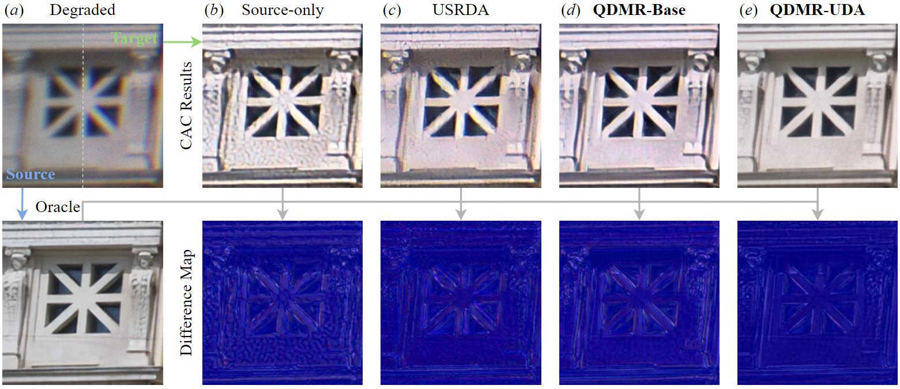

# Quantized Domain-Mixing Representation

### [Paper](https://arxiv.org/pdf/2403.10012.pdf)

> **Real-world Computational Aberration Correction via Quantized Domain-Mixing Representation** <br>
> Qi Jiang, Zhonghua Yi, Shaohua Gao, Yao Gao et al. <br>

### Abstract

Relying on paired synthetic data, existing learning-based Computational Aberration Correction (CAC) methods are confronted with the intricate and multifaceted synthetic-to-real domain gap, which leads to suboptimal performance in real-world applications. In this paper, in contrast to improving the simulation pipeline, we deliver a novel insight into real-world CAC from the perspective of Unsupervised Domain Adaptation (UDA). By incorporating readily accessible unpaired real-world data into training, we formalize the Domain Adaptive CAC (DACAC) task, and then introduce a comprehensive Real-world aberrated images (Realab) dataset to benchmark it. The setup task presents a formidable challenge due to the intricacy of understanding the target aberration domain. To this intent, we propose a novel Quantized Domain-Mixing Representation (QDMR) framework as a potent solution to the issue. QDMR adapts the CAC model to the target domain from three key aspects: (1) reconstructing aberrated images of both domains by a VQGAN to learn a Domain-Mixing Codebook (DMC) which characterizes the degradation-aware priors; (2) modulating the deep features in CAC model with DMC to transfer the target domain knowledge; and (3) leveraging the trained VQGAN to generate pseudo target aberrated images from the source ones for convincing target domain supervision. Extensive experiments on both synthetic and real-world benchmarks reveal that the models with QDMR consistently surpass the competitive methods in mitigating the synthetic-to-real gap, which produces visually pleasant real-world CAC results with fewer artifacts.

Overall illustration of our work:



### The novel DACAC task and Realab dataset
Overall illustration of the task:


We solve a significant issue of synthetic-to-real gap in real-world computational aberration correction, from a novel perspective of unsupervised domain adaptation, where the unpaired (unlabeled) real-world aberrated images are incorporated into the training process. 
For more details, please refer to our paper.

To obtain the Realab dataset, please follow this [instruction](datasets/README.md).

### QDMR: a novel framework for DACAC task
Overall illustration of QDMR:


QDMR adapts the CAC model to the target domain from three key aspects: (1) reconstructing aberrated images of both domains by a VQGAN to learn a Domain-Mixing Codebook (DMC) which characterizes the degradation-aware priors; (2) modulating the deep features in CAC model with DMC to transfer the target domain knowledge; and (3) leveraging the trained VQGAN to generate pseudo target aberrated images from the source ones for convincing target domain supervision.

### Excellent performance on DACAC task
QDMR can effectively mitigate the synthetic-to-real gap issue in real-world CAC, producing realistic aberration-free images without artifacts.


More details can be found in our paper.

#### Getting started
The implementation of our work is based on [BasicSR](https://github.com/xinntao/BasicSR), which is an open source toolbox for image/video restoration tasks. 

- Clone this repo or download the project.
```bash
git clone https://github.com/zju-jiangqi/QDMR
cd QDMR
```

- Requirements. 
```bash
python 3.10
pytorch 1.12.1
cuda 11.3
```

```bash
conda create -n QDMR python=3.10
conda activate QDMR
pip install torch==1.12.1+cu113 torchvision==0.13.1+cu113 torchaudio==0.12.1 --extra-index-url https://download.pytorch.org/whl/cu113
pip install -r requirements.txt
python setup.py develop
```

#### Training

First, train a VQGAN to learn QDMR and obtain the s2tT model.
Check and adapt the yml file according to the path of datasets and pretrained models ```options/train/Syn2RealSim/pretrain_VQGAN.yml``` for Real-Sim (or ```options/train/Syn2RealSnap/pretrain_VQGAN.yml``` for Real-Snap), then

-VQGAN pretrain
```bash
PYTHONPATH="./:${PYTHONPATH}" CUDA_VISIBLE_DEVICES=0 python basicsr/train.py -opt options/train/Syn2RealSim/pretrain_VQGAN.yml --auto_resume
```
or
```bash
PYTHONPATH="./:${PYTHONPATH}" CUDA_VISIBLE_DEVICES=0 python basicsr/train.py -opt options/train/Syn2RealSnap/pretrain_VQGAN.yml --auto_resume
```

Training files (logs, models, training states and visualizations) will be saved in the directory ```./experiments/{name}```

Then, use the pre-trained DMC and VQGAN to train QDMR-Base or QDMR-UDA. 

Our pre-trained weights are also available.
- Download the pre-trained DMC and trained models from our [Huggingface](https://huggingface.co/datasets/Zhonghua/Realab/tree/main) or [Baidu Disk]() to './pretrain'.


-QDMR-Base:
```bash
PYTHONPATH="./:${PYTHONPATH}" CUDA_VISIBLE_DEVICES=0 python basicsr/train_uda.py -opt options/train/Syn2RealSim/train_QDMR_Base.yml --auto_resume
```
or
```bash
PYTHONPATH="./:${PYTHONPATH}" CUDA_VISIBLE_DEVICES=0 python basicsr/train_uda.py -opt options/train/Syn2RealSnap/train_QDMR_Base.yml --auto_resume
```

-QDMR-UDA (2 GPUs):
```bash
PYTHONPATH="./:${PYTHONPATH}" CUDA_VISIBLE_DEVICES=0,1 python basicsr/train_uda.py -opt options/train/Syn2RealSim/train_QDMR_UDA.yml --auto_resume
```
or
```bash
PYTHONPATH="./:${PYTHONPATH}" CUDA_VISIBLE_DEVICES=0,1 python basicsr/train_uda.py -opt options/train/Syn2RealSnap/train_QDMR_UDA.yml --auto_r
```

### Testing
The referenced metrics and qualitative results can be calculated on Real-Sim:
- Real-Sim:
```bash
PYTHONPATH="./:${PYTHONPATH}" CUDA_VISIBLE_DEVICES=0 python basicsr/test.py -opt options/test/RealSim/test_QDMR_Base.yml
PYTHONPATH="./:${PYTHONPATH}" CUDA_VISIBLE_DEVICES=0 python basicsr/test.py -opt options/test/RealSim/test_QDMR_UDA.yml
```

The non-referenced metric and qualitative results can be calculated on Real-Snap:
- Real-Snap:
```bash
PYTHONPATH="./:${PYTHONPATH}" CUDA_VISIBLE_DEVICES=0 python basicsr/test.py -opt options/test/RealSnap/test_QDMR_Base.yml
PYTHONPATH="./:${PYTHONPATH}" CUDA_VISIBLE_DEVICES=0 python basicsr/test.py -opt options/test/RealSnap/test_QDMR_UDA.yml
```

Evaluating files (logs and visualizations) will be saved in the directory ```./results/{name}```

We only offer an example of the experiments on MOS-S1, where those on MOS-S2 can be implemented by changing the paths of datasets and pretrained priors.


### License

This project is released under the Apache 2.0 license.

### Citation
```
@misc{jiang2024realworld,
      title={Real-World Computational Aberration Correction via Quantized Domain-Mixing Representation}, 
      author={Qi Jiang and Zhonghua Yi and Shaohua Gao and Yao Gao and Xiaolong Qian and Hao Shi and Lei Sun and Zhijie Xu and Kailun Yang and Kaiwei Wang},
      year={2024},
      eprint={2403.10012},
      archivePrefix={arXiv},
      primaryClass={cs.CV}
}
```

### Acknowledgement
This project is built based on the excellent [BasicSR](https://github.com/xinntao/BasicSR) project.

### Contact
Should you have any questions, please contact me via `qijiang@zju.edu.cn`.
